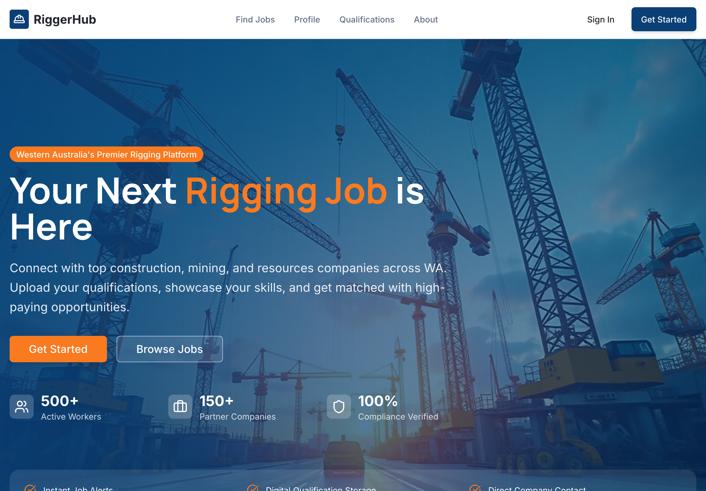
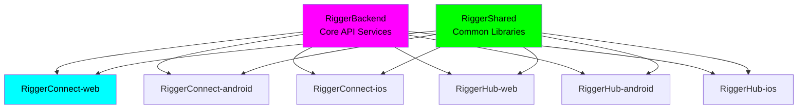

<div align="center">

# 🏗️ RiggerConnect Web Application

### **A ChaseWhiteRabbit NGO Initiative**
*Ethical Technology for Blue-Collar Excellence*

[](https://github.com/chasewhiterabbit/riggerconnect-web/actions)
[](docs/security/)
[](docs/ethics/)
[](docs/accessibility/)
[](https://www.gnu.org/licenses/gpl-3.0)

```ascii
    🏗️ CONNECTING THE BACKBONE OF INDUSTRY 🏗️
    ▲ ▲ ▲ ▲ ▲ ▲ ▲ ▲ ▲ ▲ ▲ ▲ ▲ ▲ ▲ ▲ ▲ ▲ ▲ ▲
   ╔═══════════════════════════════════════════╗
   ║  RIGGERS • SAFETY • COMMUNITY • GROWTH   ║
   ╚═══════════════════════════════════════════╝
    ▼ ▼ ▼ ▼ ▼ ▼ ▼ ▼ ▼ ▼ ▼ ▼ ▼ ▼ ▼ ▼ ▼ ▼ ▼ ▼
```

</div>

## 📍 Repository Location & Structure

**Current Location**: `/Users/tiaastor/Github/tiation-repos/RiggerConnect-web/`

This repository is part of the **Tiation Enterprise Repository Structure**, specifically designed to house **ChaseWhiteRabbit NGO's** technology initiatives following enterprise-grade development practices. 

### 🏗️ Enterprise Ecosystem
- **Repository Collection**: [Enterprise Repository Index](../ENTERPRISE_REPOSITORY_INDEX.md)
- **Related Projects**: [RiggerHub-web](../RiggerHub-web/), [RiggerBackend](../RiggerBackend/), [RiggerShared](../RiggerShared/)
- **Mobile Apps**: [RiggerConnect-android](../RiggerConnect-android/), [RiggerConnect-ios](../RiggerConnect-ios/)
- **Infrastructure**: Hosted on Hostinger VPS cluster with Kubernetes orchestration

### 🌟 NGO Integration
As a **ChaseWhiteRabbit NGO Initiative**, this project adheres to:
- ✅ **Enterprise-grade development practices**
- ✅ **Ethical technology standards**
- ✅ **Open-source commitment (GPL v3)**
- ✅ **Worker empowerment focus**
- ✅ **DevOps best practices with CI/CD**

## 📸 Platform Preview


*RiggerConnect web platform showing the main interface for rigging jobs and professional networking in Western Australia*

## 🎯 Mission Statement

RiggerConnect is a cutting-edge social networking and career development platform designed specifically for riggers in the construction, oil & gas, and industrial sectors. As part of **ChaseWhiteRabbit NGO's** mission to empower blue-collar workers with ethical technology and opportunity, we bridge the gap between traditional rigging work and modern digital networking.

### 🌟 Core Values
- 🤝 **Connect** - Industry professionals and peer networks
- 🎯 **Discover** - Career opportunities and skill development paths  
- 🛡️ **Share** - Knowledge, experiences, and safety best practices
- 📈 **Advance** - Careers through targeted networking and learning
- ⚖️ **Ethics** - Privacy-first, bias-free, worker-empowering technology

## 🔗 Related Repositories

### Core Platform Components

| Repository | Platform | Description | GitHub SSH URL |
|------------|----------|-------------|----------------|
| **RiggerBackend** | API/Backend | Core backend services and APIs for the Rigger ecosystem | `git@github.com:tiation/RiggerBackend.git` |
| **RiggerConnect-web** | Web | Professional networking platform for construction workers | `git@github.com:tiation/RiggerConnect-web.git` |
| **RiggerConnect-android** | Android | Native Android mobile networking application | `git@github.com:tiation/RiggerConnect-android.git` |
| **RiggerConnect-capacitor** | Cross-platform | Cross-platform mobile app built with Ionic Capacitor | `git@github.com:tiation/RiggerConnect-capacitor.git` |
| **RiggerConnect-ios** | iOS | Native iOS mobile networking application | `git@github.com:tiation/RiggerConnect-ios.git` |
| **RiggerHub-web** | Web | Operations management hub for business users | `git@github.com:tiation/RiggerHub-web.git` |
| **RiggerHub-android** | Android | Native Android operations management application | `git@github.com:tiation/RiggerHub-android.git` |
| **RiggerHub-ios** | iOS | Native iOS operations management application | `git@github.com:tiation/RiggerHub-ios.git` |
| **RiggerShared** | Multi-platform | Shared libraries, components, and utilities | `git@github.com:tiation/RiggerShared.git` |

### Enterprise Integration Architecture



### ChaseWhiteRabbit NGO License Framework

All repositories in the Rigger ecosystem are licensed under **GPL v3**, ensuring:
- ✅ **Open Source Transparency**: Complete code visibility and community auditing
- ✅ **Ethical Technology Standards**: Algorithmic fairness and bias prevention
- ✅ **Worker Empowerment Focus**: Technology serving users, not corporate profits
- ✅ **Community Ownership**: Improvements benefit the entire rigger community
- ✅ **Corporate Responsibility**: Commercial use must remain open and accessible

## 🚀 Technology Stack

This is a [Next.js](https://nextjs.org) project built with the modern **App Router** architecture, featuring:

- **Next.js 15.4.2** - React framework with App Router (unified structure)
- **React 19.1.0** - Latest React with concurrent features
- **TypeScript** - Type-safe development
- **Tailwind CSS 4** - Modern styling framework
- **Turbopack** - Ultra-fast bundler for development
- **Supabase** - Backend-as-a-Service with PostgreSQL

## 🚀 Quick Start

### Prerequisites

**System Requirements:**
- **Node.js**: 18.0.0 or higher (LTS recommended)
- **npm**: 9.0.0 or higher (or yarn 1.22.0+)
- **Git**: Latest version for version control

**Development Tools:**
- **Code Editor**: VS Code (recommended) with React/TypeScript extensions
- **Browser**: Chrome, Firefox, Safari, or Edge with dev tools
- **API Testing**: Browser dev tools or separate API client

**Verify Installation:**
```bash
# Check Node.js version
node --version  # Should be 18.0.0+

# Check npm version
npm --version   # Should be 9.0.0+

# Check git version
git --version   # Should be latest
```

### Installation & Setup

#### 1. Clone the Repository
```bash
# Using SSH (recommended)
git clone git@github.com:tiation/RiggerConnect-web.git
cd RiggerConnect-web

# Or using HTTPS
git clone https://github.com/tiation/RiggerConnect-web.git
cd RiggerConnect-web
```

#### 2. Install Dependencies
```bash
# Install project dependencies
npm install

# Or using Yarn (if preferred)
yarn install

# Install global dependencies (optional)
npm install -g typescript @next/cli
```

#### 3. Environment Configuration
```bash
# Copy environment template
cp .env.example .env.local

# Edit .env.local with your configuration
# Required environment variables:
```

**Essential Environment Variables:**
```bash
# App Configuration
NEXT_PUBLIC_APP_URL=http://localhost:3000
NEXT_PUBLIC_API_URL=http://localhost:5000/api
NODE_ENV=development

# Supabase Configuration
NEXT_PUBLIC_SUPABASE_URL=https://your-project.supabase.co
NEXT_PUBLIC_SUPABASE_ANON_KEY=your-supabase-anon-key
SUPABASE_SERVICE_ROLE_KEY=your-supabase-service-key

# Authentication
NEXTAUTH_URL=http://localhost:3000
NEXTAUTH_SECRET=your-nextauth-secret-min-32-chars

# External Services
NEXT_PUBLIC_GOOGLE_MAPS_API_KEY=your-google-maps-key
NEXT_PUBLIC_STRIPE_PUBLISHABLE_KEY=pk_test_your-stripe-key
STRIPE_SECRET_KEY=sk_test_your-stripe-secret

# Analytics (optional)
NEXT_PUBLIC_GOOGLE_ANALYTICS_ID=GA_MEASUREMENT_ID
NEXT_PUBLIC_SENTRY_DSN=your-sentry-dsn

# Email Configuration (for contact forms)
SMTP_HOST=smtp.gmail.com
SMTP_PORT=587
SMTP_USER=your-email@gmail.com
SMTP_PASS=your-app-password
```

#### 4. Start Development Server
```bash
# Start development server with hot reload
npm run dev

# Server will start at http://localhost:3000
# API routes available at http://localhost:3000/api/*
```

### Development Workflow

#### Daily Development Commands
```bash
# Start development server
npm run dev

# Start with Turbopack (faster bundling)
npm run dev:turbo

# Type checking
npm run type-check
npm run type-check:watch  # Watch mode

# Code quality
npm run lint              # ESLint
npm run lint:fix          # Auto-fix ESLint issues
npm run format            # Prettier formatting
npm run format:check      # Check formatting

# Testing
npm test                  # Run all tests
npm run test:watch        # Watch mode
npm run test:coverage     # Coverage report
npm run test:e2e          # End-to-end tests with Playwright

# Build and deployment
npm run build             # Production build
npm run start             # Start production server
npm run preview           # Preview production build
```

#### Production Build
```bash
# Build for production
npm run build

# Test production build locally
npm run start

# Analyze bundle size
npm run analyze

# Export static build (if configured)
npm run export
```

### Testing Your Setup

#### Verify Development Environment
```bash
# Check if development server is running
curl http://localhost:3000

# Expected: HTML response with Next.js app

# Test API routes
curl http://localhost:3000/api/health

# Expected: {"status":"ok","timestamp":"..."}
```

#### Browser Testing
1. **Open Development Server**: http://localhost:3000
2. **Check Console**: No errors in browser dev tools
3. **Test Navigation**: All routes should load properly
4. **Mobile View**: Test responsive design on different screen sizes
5. **Network Tab**: Verify API calls are working

### Common Development Tasks

#### Creating New Components
```bash
# Generate new page component
npm run generate:page AboutPage

# Generate new UI component
npm run generate:component Button

# Generate new API route
npm run generate:api users
```

#### Database & Backend Integration
```bash
# Generate Prisma client (if using Prisma)
npm run db:generate

# Run database migrations
npm run db:migrate

# Seed database with sample data
npm run db:seed

# Reset database (development only)
npm run db:reset
```

### Troubleshooting Setup Issues

#### Port Already in Use
```bash
# Find process using port 3000
lsof -ti:3000

# Kill process if needed
kill -9 $(lsof -ti:3000)

# Or use different port
PORT=3001 npm run dev
```

#### Node.js Version Issues
```bash
# Using nvm to manage Node.js versions
nvm install 18
nvm use 18
nvm alias default 18

# Verify version
node --version
```

#### Environment Variables Not Loading
```bash
# Check if .env.local exists
ls -la .env*

# Verify environment variables are loaded
echo $NEXT_PUBLIC_API_URL

# Restart development server after changes
npm run dev
```

#### Build Issues
```bash
# Clear Next.js cache
rm -rf .next

# Clear node_modules and reinstall
rm -rf node_modules package-lock.json
npm install

# Check for TypeScript errors
npm run type-check
```

### Development Tools Integration

#### VS Code Setup
Recommended VS Code extensions:
```json
{
  "recommendations": [
    "bradlc.vscode-tailwindcss",
    "ms-vscode.vscode-typescript-next",
    "esbenp.prettier-vscode",
    "ms-vscode.vscode-eslint",
    "formulahendry.auto-rename-tag",
    "christian-kohler.path-intellisense"
  ]
}
```

#### Browser Extensions
Helpful browser extensions for development:
- **React Developer Tools**: Debug React components
- **Redux DevTools**: Debug state management
- **Lighthouse**: Performance auditing
- **WAVE**: Accessibility testing

## 🎯 DevOps Processes

RiggerConnect-web adheres to robust CI/CD best practices:

- **Automated Testing**: Utilizes GitHub Actions for continuous integration, automated testing, and static analysis.
- **Automated Deployment**: Deployments are managed through GitLab pipelines.
- **Infrastructure as Code**: Terraform setups ensure consistent and reproducible infrastructure across environments.
- **Monitoring 6 Logging**: Integrated with Grafana and ELK Stack for real-time monitoring 6 comprehensive log management.

## 🏗️ Project Structure
```
RiggerConnect-web/
├── app/                    # Next.js App Router (unified routing)
│   ├── page.tsx           # Home page
│   ├── layout.tsx         # Root layout
│   ├── jobs/page.tsx      # Jobs listing
│   ├── post-job/page.tsx  # Job posting form
│   └── register/page.tsx  # User registration
├── lib/                   # Shared utilities and services
│   ├── auth/              # Authentication utilities
│   ├── services/          # API services
│   └── supabase/          # Database client configuration
├── public/                # Static assets
├── docs/                  # Project documentation
└── ci/                    # CI/CD configuration
```

## 🛠️ Getting Started

First, run the development server:

```bash
npm run dev
# or
yarn dev
# or
pnpm dev
# or
bun dev
```

Open [http://localhost:3000](http://localhost:3000) with your browser to see the result.

You can start editing the page by modifying `app/page.tsx`. The page auto-updates as you edit the file.

This project uses [`next/font`](https://nextjs.org/docs/app/building-your-application/optimizing/fonts) to automatically optimize and load [Geist](https://vercel.com/font), a new font family for Vercel.

## 🏗️ Enterprise Architecture

### Cloud Infrastructure
- **Hosting**: Kubernetes on Hostinger VPS cluster
- **Database**: Supabase with PostgreSQL backend
- **CDN**: CloudFlare for global content delivery
- **Monitoring**: Grafana + ElasticSearch stack
- **CI/CD**: GitLab pipelines with automated testing

### DevOps Best Practices
- ✅ **Infrastructure as Code**: Terraform configurations
- ✅ **Container Security**: Regular vulnerability scanning
- ✅ **Blue-Green Deployments**: Zero-downtime releases
- ✅ **Health Monitoring**: 24/7 system monitoring with Grafana
- ✅ **Backup Strategy**: Multi-region data redundancy
- ✅ **CI/CD Pipeline**: GitLab CI/CD with automated testing and deployment
- ✅ **Docker Containerization**: Multi-stage builds with security hardening
- ✅ **Kubernetes Orchestration**: Helm charts for production deployment

### Deployment Infrastructure
- **Primary VPS**: docker.sxc.codes (145.223.22.7) - CI/CD runner and container build host
- **Helm Registry**: helm.sxc.codes (145.223.21.248) - Kubernetes deployment manager
- **Monitoring**: grafana.sxc.codes (153.92.214.1) - Observability and alerts
- **Database**: supabase.sxc.codes (93.127.167.157) - Backend as a Service
- **Notification Alerts**: Configured for tiatheone@protonmail.com, jackjonas95@gmail.com

## 📚 Documentation

| Resource | Description |
|----------|-------------|
| [📖 Full Documentation](docs/) | Complete project documentation |
| [🔒 Security Guidelines](docs/security/) | Security protocols and best practices |
| [🧪 Testing Strategy](docs/testing/) | Quality assurance and testing approach |
| [⚖️ Ethics Framework](docs/ethics/) | Responsible AI and ethical guidelines |
| [🏗️ Architecture](docs/architecture/) | System design and technical specs |
| [🚀 Deployment Guide](docs/deployment/) | Production deployment instructions |

## 🤝 Contributing

We welcome contributions from the rigger community and ethical technology advocates!

1. **Read our [Contributing Guidelines](CONTRIBUTING.md)**
2. **Check our [Code of Conduct](docs/ethics/)**
3. **Browse [Open Issues](https://github.com/chasewhiterabbit/riggerconnect-web/issues)**
4. **Submit Pull Requests** following our standards

### Development Setup
```bash
# Clone the repository
git clone git@github.com:chasewhiterabbit/riggerconnect-web.git
cd riggerconnect-web

# Install dependencies
npm install

# Set up environment
cp .env.example .env.local
# Edit .env.local with your configuration

# Run development server
npm run dev

# Run tests
npm test

# Run security audit
npm run security:audit
```

## 🛡️ Security & Ethics

### Security Features
- 🔐 **End-to-End Encryption** for sensitive communications
- 🛡️ **Multi-Factor Authentication** for account protection
- 🔍 **Regular Security Audits** and penetration testing
- 📊 **Privacy-First Analytics** with user consent

### Ethical Commitments
- 🌟 **No Algorithmic Bias** in job matching or recommendations
- 🔒 **Data Sovereignty** - users own and control their data
- 🤝 **Worker Empowerment** - technology that serves users
- 🌍 **Social Impact** - measurable positive outcomes for communities

## 📊 Performance Metrics

- ⚡ **Page Load Time**: < 3 seconds (3G network)
- 🎯 **Lighthouse Score**: 95+ on all metrics
- 📱 **Mobile Responsive**: 100% feature parity
- ♿ **Accessibility**: WCAG 2.1 AA compliant
- 🔒 **Security Score**: A+ rating

## 🌍 Community Impact

### Current Metrics
- 👥 **Active Users**: Growing rigger community
- 💼 **Job Placements**: Career advancement tracking
- 🎓 **Skills Developed**: Learning outcome measurements
- 🛡️ **Safety Improvements**: Incident reduction reporting

### Goals for 2024
- 📈 **10,000+ Active Riggers** on the platform
- 🎯 **1,000+ Job Placements** through our network
- 🏆 **500+ Safety Certifications** earned
- 🤝 **100+ Employer Partnerships** established

## 🚀 Deployment

### Production Environment
```bash
# Build production version
npm run build

# Start production server
npm start

# Deploy to staging
npm run deploy:staging

# Deploy to production (requires approval)
npm run deploy:production
```

### Infrastructure
- **Production**: `https://riggerconnect.chasewhiterabbit.org`
- **Staging**: `https://staging.riggerconnect.chasewhiterabbit.org`
- **Development**: `http://localhost:3000`

## 📞 Support & Contact

### Community Support
- 💬 **Community Forum**: [community.riggerconnect.org](https://community.riggerconnect.org)
- 📧 **General Support**: support@chasewhiterabbit.org
- 🔒 **Security Issues**: security@chasewhiterabbit.org
- ⚖️ **Ethics Concerns**: ethics@chasewhiterabbit.org

### ChaseWhiteRabbit NGO
- 🌐 **Website**: [chasewhiterabbit.org](https://chasewhiterabbit.org)
- 📧 **Contact**: info@chasewhiterabbit.org
- 🐦 **Twitter**: [@ChaseWhiteRabbitNGO](https://twitter.com/ChaseWhiteRabbitNGO)
- 💼 **LinkedIn**: [ChaseWhiteRabbit NGO](https://linkedin.com/company/chasewhiterabbit-ngo)


## 🤝 Project Team & Purpose

This project is part of a broader suite of repositories aimed at supporting the **transient rigging and heavy lifting industry** in Western Australia and beyond.

🔗 **Related Repositories**:

* [`RiggerConnect-web`](https://github.com/ChaseWhiteRabbit/RiggerConnect-web) - Professional networking platform for construction workers
* [`RiggerConnect-android`](https://github.com/ChaseWhiteRabbit/RiggerConnect-android) - Native Android mobile networking application
* [`RiggerConnect-ios`](https://github.com/ChaseWhiteRabbit/RiggerConnect-ios) - Native iOS mobile networking application
* [`RiggerConnect-capacitor`](https://github.com/ChaseWhiteRabbit/RiggerConnect-capacitor) - Cross-platform mobile app built with Ionic Capacitor
* [`RiggerHub-web`](https://github.com/ChaseWhiteRabbit/RiggerHub-web) - Operations management hub for business users
* [`RiggerHub-android`](https://github.com/ChaseWhiteRabbit/RiggerHub-android) - Native Android operations management application
* [`RiggerHub-ios`](https://github.com/ChaseWhiteRabbit/RiggerHub-ios) - Native iOS operations management application
* [`RiggerShared`](https://github.com/ChaseWhiteRabbit/RiggerShared) - Shared libraries, components, and utilities
* [`RiggerBackend`](https://github.com/ChaseWhiteRabbit/RiggerBackend) - Core backend services and APIs for the Rigger ecosystem

📬 **Contact**:
For questions, ideas, or collaboration inquiries, please reach out to:

* **Jack Jonas** – [jackjonas95@gmail.com](mailto:jackjonas95@gmail.com)
* **Tia** – [tiatheone@protonmail.com](mailto:tiatheone@protonmail.com)

---

### 🙌 About the Founders

**Jack Jonas** is a seasoned rigger, crane operator, and heavy vehicle mechanic based in Karratha, Western Australia. His firsthand experience in the field shapes the practical backbone of this platform.

**Tia** is a Swedish software developer and founder of the NGO **ChaseWhiteRabbit**, which is dedicated to building inclusive, systemic solutions to complex challenges.

Together, they created this SaaS platform to:

* Help connect riggers, doggers, and crane operators to real work opportunities.
* Support better logistics, transparency, and compliance in the field.
* Fund and sustain the good work being done by **ChaseWhiteRabbit** in disadvantaged communities.

### Cross-Linking the Rigger Ecosystem

- For an overview of all related projects and repositories, please visit:
  - [RiggerConnect-android](../RiggerConnect-android/)
  - [RiggerConnect-ios](../RiggerConnect-ios/)
  - [RiggerHub-web](../RiggerHub-web/)
  - [RiggerHub-android](../RiggerHub-android/)
  - [RiggerHub-ios](../RiggerHub-ios/)
  - [RiggerShared](../RiggerShared/)
  - [RiggerBackend](../RiggerBackend/)

These links provide easy access to all components of the Rigger ecosystem and facilitate a comprehensive understanding of interconnected parts.

## 📜 License

This project is licensed under the **GNU General Public License v3.0** - see the [LICENSE](LICENSE) file for details.

### Why GPL v3?
As an ethical NGO initiative, we believe in:
- **Open Source Transparency**: All code visible and auditable
- **Community Ownership**: Improvements benefit everyone
- **Corporate Responsibility**: Commercial use must remain open
- **Worker Protection**: Technology that can't be locked away from users

---

<div align="center">

### 🏗️ Built by Riggers, for Riggers 🏗️

**ChaseWhiteRabbit NGO** | *Transforming Lives Through Ethical Technology*

```ascii
🔧 SAFETY FIRST • COMMUNITY ALWAYS • ETHICS FOREVER 🔧
```

[](https://chasewhiterabbit.org)
[](docs/ethics/)
[](#)

*"Technology should lift up workers, not replace them."*

</div>
