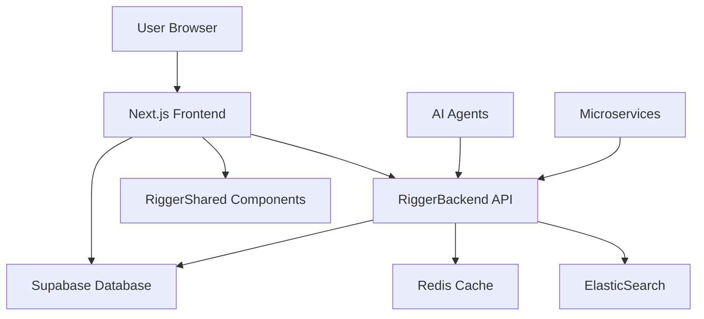
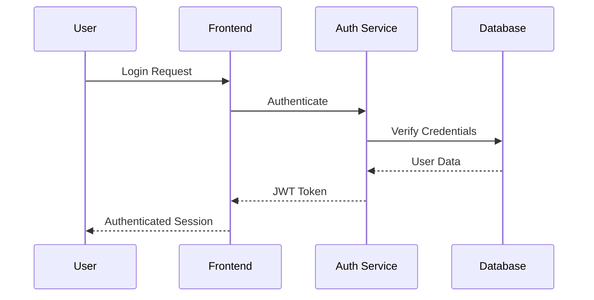

# Architecture Overview - RiggerConnect Web

## System Architecture

RiggerConnect Web is built using modern web technologies with a focus on scalability, maintainability, and ethical technology practices.

### High-Level Architecture



### Technology Stack

#### Frontend Layer
- **Framework**: Next.js 14 with App Router
- **UI Library**: React 18 with hooks and concurrent features
- **Styling**: Tailwind CSS with custom design system
- **State Management**: Redux Toolkit with RTK Query
- **Authentication**: NextAuth.js with JWT tokens
- **Type Safety**: TypeScript with strict configuration

#### Integration Layer
- **RiggerShared**: Shared components and utilities
- **API Client**: Custom Supabase client with real-time features
- **AI Agents**: Intelligent recommendation system
- **Microservices**: Event-driven service communication

#### Backend Integration
- **Primary API**: RiggerBackend microservices
- **Database**: Supabase with PostgreSQL
- **Real-time**: WebSocket connections for live updates
- **File Storage**: Supabase Storage for media files

## Component Architecture

### App Router Structure

```
app/
├── page.tsx              # Home page
├── layout.tsx            # Root layout
├── globals.css           # Global styles
├── (auth)/               # Authentication routes
│   ├── login/
│   └── register/
├── jobs/                 # Job-related pages
│   ├── page.tsx         # Job listings
│   ├── [id]/page.tsx    # Job details
│   └── post/page.tsx    # Job posting
├── profile/              # User profile
├── network/              # Networking features
└── api/                  # API routes
    ├── auth/
    └── jobs/
```

### Component Hierarchy

```
Layout Components:
├── RootLayout
├── Header (from RiggerShared)
├── Navigation
├── Footer (from RiggerShared)
└── Sidebar

Feature Components:
├── JobCard (from RiggerShared)
├── UserProfile
├── NetworkingHub
├── SafetyAlerts
└── LearningCenter

Utility Components:
├── Loading
├── ErrorBoundary
├── Modal
└── Form Components
```

## Data Flow

### State Management

1. **Global State**: Redux Toolkit for application-wide state
2. **Server State**: RTK Query for API data management
3. **Local State**: React hooks for component-specific state
4. **Form State**: React Hook Form for form management

### API Integration

```typescript
// API service structure
interface APIService {
  auth: AuthService;
  jobs: JobsService;
  users: UsersService;
  networking: NetworkingService;
  safety: SafetyService;
}

// Integration with RiggerBackend
const api = createApi({
  reducerPath: 'riggerApi',
  baseQuery: fetchBaseQuery({
    baseUrl: '/api/',
    prepareHeaders: (headers, { getState }) => {
      // Include authentication headers
      return headers;
    },
  }),
  tagTypes: ['Job', 'User', 'Connection'],
  endpoints: (builder) => ({
    // API endpoints
  }),
});
```

## AI Agents Integration

### Intelligent Features

1. **Job Matching**: ML-powered job recommendations
2. **Network Suggestions**: Connection recommendations
3. **Content Moderation**: Automated safety and ethics checking
4. **Career Guidance**: Personalized career path suggestions

### Ethical AI Implementation

- **Bias Prevention**: Regular algorithmic auditing
- **Transparency**: Explainable AI decisions
- **User Control**: Opt-out mechanisms for all AI features
- **Privacy**: On-device processing where possible

## Microservices Integration

### Service Communication

- **API Gateway**: Central routing through RiggerBackend
- **Event Bus**: Redis pub/sub for real-time updates
- **Service Discovery**: Kubernetes service mesh
- **Load Balancing**: NGINX with health checks

### Services Used

1. **User Service**: Authentication and profile management
2. **Job Service**: Job posting and matching
3. **Network Service**: Professional connections
4. **Safety Service**: Safety alerts and compliance
5. **Analytics Service**: Usage metrics and insights

## Security Architecture

### Authentication Flow



### Security Measures

- **Authentication**: JWT tokens with refresh mechanism
- **Authorization**: Role-based access control (RBAC)
- **Data Protection**: End-to-end encryption for sensitive data
- **Input Validation**: Comprehensive sanitization
- **CSRF Protection**: Token-based CSRF prevention
- **XSS Prevention**: Content Security Policy headers

## Performance Optimization

### Frontend Performance

- **Code Splitting**: Route-based and component-based splitting
- **Image Optimization**: Next.js Image component with WebP
- **Bundle Analysis**: Regular bundle size monitoring
- **Caching**: Aggressive caching strategies
- **Lazy Loading**: Components and routes loaded on demand

### API Performance

- **Query Optimization**: Efficient database queries
- **Caching**: Redis caching for frequently accessed data
- **CDN**: Static asset delivery via CloudFlare
- **Compression**: Gzip/Brotli compression
- **Rate Limiting**: API abuse prevention

## Deployment Architecture

### Infrastructure

- **Hosting**: Kubernetes on Hostinger VPS cluster
- **CI/CD**: GitLab pipelines with automated testing
- **Monitoring**: Grafana dashboards with alerts
- **Logging**: ELK stack for centralized logging
- **Backup**: Automated database backups

### Environment Management

- **Development**: Local development with hot reloading
- **Staging**: Feature testing environment
- **Production**: High-availability production setup
- **Monitoring**: Real-time health monitoring

## Scalability Considerations

### Horizontal Scaling

- **Load Balancing**: Multiple frontend instances
- **Database Scaling**: Read replicas and connection pooling
- **CDN**: Global content distribution
- **Microservices**: Independent service scaling

### Performance Monitoring

- **Core Web Vitals**: LCP, FID, CLS tracking
- **User Experience**: Real user monitoring (RUM)
- **Error Tracking**: Comprehensive error reporting
- **Analytics**: Privacy-respecting usage analytics

## Future Architecture Plans

### Planned Enhancements

- **Progressive Web App**: Enhanced mobile experience
- **Real-time Collaboration**: WebRTC for video calls
- **Advanced AI**: More sophisticated recommendation systems
- **Blockchain Integration**: Decentralized credential verification
- **Multi-language Support**: Internationalization (i18n)

### Scalability Roadmap

- **Global CDN**: Multi-region content delivery
- **Edge Computing**: Serverless edge functions
- **Advanced Caching**: Distributed caching strategies
- **Database Sharding**: Horizontal database scaling

# Architecture Documentation

## Overview
This directory contains architectural documentation for the Rigger ecosystem component. The architecture follows enterprise-grade patterns and practices to ensure scalability, maintainability, and security.

## System Architecture

### High-Level Architecture
```
┌─────────────────┐    ┌─────────────────┐    ┌─────────────────┐
│   Frontend      │    │   Backend API   │    │   Database      │
│   (React/      │◄──►│   (Node.js/     │◄──►│   (Supabase/    │
│   Flutter)      │    │   Python)       │    │   PostgreSQL)   │
└─────────────────┘    └─────────────────┘    └─────────────────┘
```

### Core Components

#### 1. Presentation Layer
- **Responsibility**: User interface and user experience
- **Technologies**: React.js, Flutter, React Native
- **Patterns**: Component-based architecture, State management

#### 2. Business Logic Layer
- **Responsibility**: Core business rules and workflows
- **Technologies**: Node.js, Python, TypeScript
- **Patterns**: Service-oriented architecture, Domain-driven design

#### 3. Data Layer
- **Responsibility**: Data persistence and retrieval
- **Technologies**: Supabase, PostgreSQL, Redis
- **Patterns**: Repository pattern, CQRS

### Security Architecture

#### Authentication & Authorization
- JWT-based authentication
- Role-based access control (RBAC)
- OAuth 2.0 integration
- Multi-factor authentication (MFA)

#### Data Protection
- End-to-end encryption for sensitive data
- Data classification and handling procedures
- GDPR compliance measures
- Audit logging and monitoring

### Deployment Architecture

#### Infrastructure
- **Development**: Local Docker containers
- **Staging**: Kubernetes on docker.sxc.codes (145.223.22.7)
- **Production**: Multi-zone deployment with load balancing
- **Monitoring**: Grafana dashboard on grafana.sxc.codes (153.92.214.1)

#### CI/CD Pipeline
```
┌──────────┐    ┌──────────┐    ┌──────────┐    ┌──────────┐
│   Git    │───►│  GitLab  │───►│  Docker  │───►│   K8s    │
│  Commit  │    │    CI    │    │  Build   │    │  Deploy  │
└──────────┘    └──────────┘    └──────────┘    └──────────┘
```

### Integration Architecture

#### External Services
- **Supabase**: Backend-as-a-Service for database and auth
- **Payment Processing**: Secure payment gateway integration
- **Communication**: Email, SMS, and push notification services
- **Analytics**: User behavior and system performance tracking

#### API Design
- RESTful API design principles
- GraphQL for complex data relationships
- API versioning strategy
- Rate limiting and throttling
- Comprehensive API documentation

### Performance Architecture

#### Optimization Strategies
- **Caching**: Redis for session and data caching
- **CDN**: Content delivery network for static assets
- **Database**: Query optimization and indexing
- **Code Splitting**: Lazy loading for frontend components

#### Monitoring and Observability
- **Logging**: Centralized logging with ELK stack (elastic.sxc.codes)
- **Metrics**: Application and infrastructure metrics
- **Tracing**: Distributed tracing for microservices
- **Alerting**: Proactive monitoring and incident response

## Design Patterns

### Frontend Patterns
- **Component Composition**: Reusable UI components
- **State Management**: Centralized state with Redux/MobX
- **Lazy Loading**: Performance optimization
- **Progressive Web App**: Offline capabilities

### Backend Patterns
- **Microservices**: Service decomposition
- **Event-Driven**: Asynchronous processing
- **Repository Pattern**: Data access abstraction
- **Factory Pattern**: Object creation abstraction

### Data Patterns
- **Database per Service**: Service isolation
- **Event Sourcing**: Audit trail and state reconstruction
- **CQRS**: Command Query Responsibility Segregation
- **Saga Pattern**: Distributed transaction management

## Quality Attributes

### Scalability
- Horizontal scaling capabilities
- Load balancing and distribution
- Auto-scaling based on demand
- Performance benchmarks and targets

### Reliability
- Fault tolerance and recovery
- Backup and disaster recovery
- Health checks and monitoring
- SLA and uptime requirements

### Security
- Security by design principles
- Threat modeling and risk assessment
- Penetration testing and vulnerability scanning
- Compliance with security standards

### Maintainability
- Clean code principles
- Comprehensive testing strategy
- Documentation and code comments
- Refactoring and technical debt management

## Technology Stack

### Frontend Technologies
- **Web**: React.js, TypeScript, Material-UI/Tailwind CSS
- **Mobile**: Flutter (iOS/Android), React Native
- **State Management**: Redux Toolkit, MobX
- **Testing**: Jest, React Testing Library, Cypress

### Backend Technologies
- **Runtime**: Node.js, Python
- **Frameworks**: Express.js, FastAPI, NestJS
- **Database**: PostgreSQL, Redis, Elasticsearch
- **Message Queue**: Redis, RabbitMQ

### DevOps Technologies
- **Containerization**: Docker, Docker Compose
- **Orchestration**: Kubernetes, Helm
- **CI/CD**: GitLab CI, GitHub Actions
- **Monitoring**: Grafana, Prometheus, ELK Stack

## Architecture Decisions

### ADR (Architecture Decision Records)
This section should contain links to specific architecture decision records that document important architectural choices and their rationale.

### Trade-offs and Constraints
- Performance vs. Cost optimization
- Security vs. Usability balance
- Scalability vs. Complexity considerations
- Technology choices and vendor dependencies

## Future Considerations

### Roadmap Items
- Migration to cloud-native architecture
- Implementation of AI/ML capabilities
- Enhanced real-time features
- Advanced analytics and reporting

### Technology Evolution
- Framework and library upgrades
- New technology adoption criteria
- Legacy system modernization
- Performance optimization initiatives

---

**Document Version**: 1.0
**Last Updated**: January 2025
**Maintained By**: Rigger Architecture Team
**Review Cycle**: Quarterly

For questions or updates to this architecture documentation, please contact:
- **Primary**: tiatheone@protonmail.com
- **Technical**: garrett@sxc.codes
